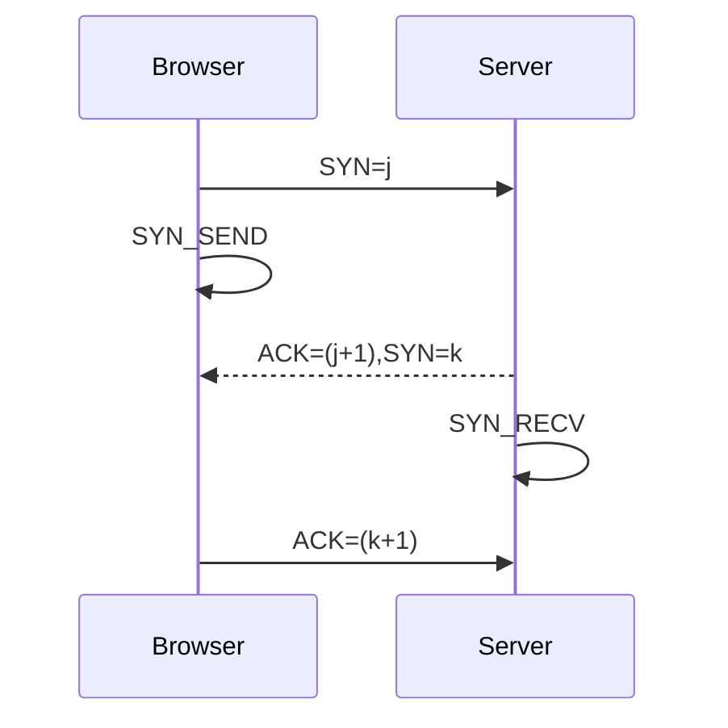
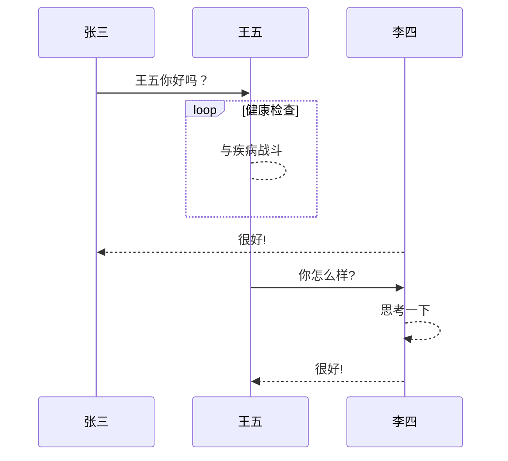

### 1.用Typora画时序图方式一



#### 上图代码

```
​```mermaid
sequenceDiagram
Browser ->> Server:SYN=j
Browser ->> Browser:SYN_SEND
Server-->>Browser:ACK=(j+1),SYN=k
Server ->> Server:SYN_RECV
Browser->>Server:ACK=(k+1)
​```
```

#### 关键点1

```
···符号和mermaid关键字、sequenceDiagram关键字
```

#### 关键点2

```
-> 表示实线
->> 表示实线带箭头
--> 表示虚线
-->> 表示虚线带箭头
```


### 2.用Typora画时序图方式二

```sequence
iConnect->>AudioKit(D):广播通知发现音频设备
AudioKit(D)->>AudioKit(D):进程启动
AudioKit(U)->>AudioKit(U):靠近弹窗特性
AudioKit(D)->>iConnect:获取产品信息
iConnect->>AudioKit(D):回调产品信息
AudioKit(D)->>Server:通过Http以产品信息请求json文件
Server->>AudioKit(D):返回json文件
AudioKit(D)->>AudioKit(D):解析json文件，获取资源文件（url、版本号信息）列表
AudioKit(D)->>AudioKit(D):遍历资源文件列表，对比当前版本号，选择有新版本的资源下载
AudioKit(D)->>Server:Http请求下载新版本资源文件
Server->>AudioKit(D):传输文件
AudioKit(D)->>AudioKit(D):资源文件解压，保存新的当前版本号
```

#### 上图代码

```
​```sequence
iConnect->>AudioKit(D):广播通知发现音频设备
AudioKit(D)->>AudioKit(D):进程启动
AudioKit(U)->>AudioKit(U):靠近弹窗特性
AudioKit(D)->>iConnect:获取产品信息
iConnect->>AudioKit(D):回调产品信息
AudioKit(D)->>Server:通过Http以产品信息请求json文件
Server->>AudioKit(D):返回json文件
AudioKit(D)->>AudioKit(D):解析json文件，获取资源文件（url、版本号信息）列表
AudioKit(D)->>AudioKit(D):遍历资源文件列表，对比当前版本号，选择有新版本的资源下载
AudioKit(D)->>Server:Http请求下载新版本资源文件
Server->>AudioKit(D):传输文件
AudioKit(D)->>AudioKit(D):资源文件解压，保存新的当前版本号
​```
```

#### 关键点 (与方式一区别)

```
···符号和sequence关键字
```


### 3.采用方式一画标准时序图



#### 上图代码

```
​```mermaid
sequenceDiagram
    张三->>王五: 王五你好吗？
    loop 健康检查
        王五-->王五: 与疾病战斗
    end
    李四-->>张三: 很好!
    王五->>李四: 你怎么样?

    李四-->>李四: 思考一下
  
    李四-->>王五: 很好!
​```
```

#### 关键点

```
loop end关键字
```

